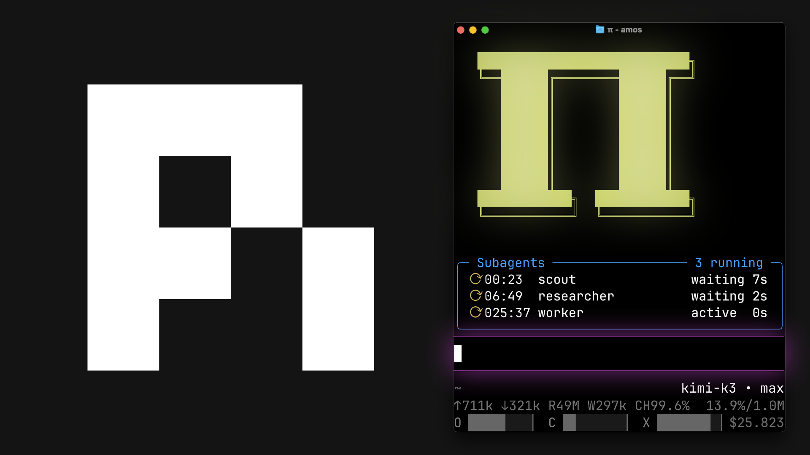

# pi-config

[](https://www.youtube.com/@EeroAlvar)

My personal [pi](https://github.com/earendil-works/pi) configuration.

The setup from [My Pi Setup After 6 Months](https://www.youtube.com/@EeroAlvar) (and its predecessor, [Pi Coding Agent Setup After 2 Months](https://www.youtube.com/watch?v=DWWrLlM3gwQ)).

This is **not** meant to be installed as one big package. Browse the repo and copy the pieces you want into your own Pi config.

Some extensions are big enough to live in their own repositories:

- **[pi-interactive-subagents](https://github.com/amosblomqvist/pi-interactive-subagents)** — async, interactive subagents in multiplexer panes
- **[pi-observational-memory](https://github.com/amosblomqvist/pi-observational-memory)** — tiered session memory with deterministic compaction
- **[pi-dictate](https://github.com/amosblomqvist/pi-dictate)** — real-time voice dictation inside pi
- **[learn](https://github.com/amosblomqvist/learn)** — my AI learning system, built on top of this config

This repo contains everything else.

## Copy an extension

Single-file extension:

```bash
cp extensions/ask-user-question.ts ~/.pi/agent/extensions/
```

Directory extension:

```bash
cp -r extensions/browser ~/.pi/agent/extensions/
```

If the copied extension has a `package.json`, install its deps:

```bash
cd ~/.pi/agent/extensions/browser
npm install
```

Then restart pi or run `/reload`.

## Copy a skill

```bash
cp -r skills/pdf-reader ~/.pi/agent/skills/
```

Then restart pi or run `/reload`.

## Do not clone over your config

Avoid cloning this repo directly into `~/.pi/agent` unless it is a fresh setup. If you already use pi, copy individual files/folders instead so you don't replace your own config.

## Contents

### Extensions

- `ask-user-question.ts` — the agent asks you a question through a UI popup; popups from different extensions serialize via a shared UI lock
- `bash-guard/` — hooks that catch dangerous bash commands before they run, with an on/off toggle
- `browser/` — Playwright-driven headless Chromium the agent can drive (navigate, eval JS, inspect network/console, click, screenshot); off by default, enable with `/browser on`
- `custom-header.ts` — the big capital Π header
- `interactive-subagents/` — stub, see [pi-interactive-subagents](https://github.com/amosblomqvist/pi-interactive-subagents)
- `observational-memory/` — stub, see [pi-observational-memory](https://github.com/amosblomqvist/pi-observational-memory)
- `prompt-snippets/` — small, reusable behavior rules toggled onto a message before sending; reset after send
- `web-fetch/` — fetch a URL and get clean markdown
- `web-search/` — web search

### Skills

- `analyze-sessions/` — Python scripts to query past pi sessions: cost rollups, prompt-pattern mining, session rendering
- `pdf-reader/` — read PDFs (lecture notes, papers) into the context
- `web-debug/` — a playbook for debugging frontend issues with the browser extension's tools
- `youtube-transcript/` — fetch a YouTube video's title and transcript as JSON

### Deprecated

`deprecated/` holds the extensions and skills from the two-month setup that are no longer in active use. They still work; they just didn't earn their place. Kept for reference.

## Dependencies

Extension-local npm deps are kept with the extension. Run `npm install` only in copied extensions that include a `package.json`:

- `bash-guard/`
- `browser/` (also run `npx playwright install chromium` once)
- `web-fetch/`

Optional system tools:

```bash
brew install yt-dlp ffmpeg
```

Used by `youtube-transcript/`. Python 3 is needed for `youtube-transcript/` and `analyze-sessions/` (stdlib only).

PDF reader setup after copying `skills/pdf-reader/`:

```bash
python3 -m venv ~/.pi/agent/skills/pdf-reader/.venv
~/.pi/agent/skills/pdf-reader/.venv/bin/pip install -r ~/.pi/agent/skills/pdf-reader/requirements.txt
```
